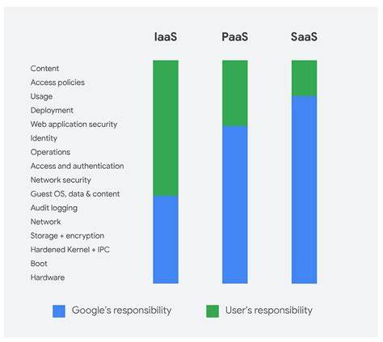

# Google Cloud Shared Responsibility Model

## Overview

The **Google Cloud Shared Responsibility Model** defines the division of security responsibilities between Google Cloud and its customers. This model is essential for understanding what aspects of security Google Cloud manages and what aspects the customer is responsible for when using Google Cloud services. The key idea is that while Google Cloud provides a secure infrastructure, the customer has specific responsibilities for securing their own data and applications.

<figure><figcaption></figcaption></figure>

### Breakdown of the Shared Responsibility Model

The model divides security responsibilities into **two main layers**:

1. **Google Cloud's Responsibilities (Security "of" the cloud)**: Google is responsible for securing the underlying infrastructure that supports the cloud services. This includes managing physical security, network security, and the systems that deliver Google Cloud’s core services. Specifically, Google is responsible for:
   * **Physical security**: Protecting the data centers, including access control, monitoring, and physical safeguards for servers, storage devices, and network equipment.
   * **Network security**: Ensuring secure network infrastructure, including the design and security of data transmission within Google’s infrastructure.
   * **Hardware and software**: Managing, patching, and maintaining the hardware, hypervisors, operating systems, and other foundational software components that deliver cloud services like Compute Engine, BigQuery, and Cloud Storage.
   * **Compliance and certifications**: Meeting regulatory requirements and maintaining certifications like ISO/IEC 27001, SOC 1/2/3, PCI DSS, and others, providing customers with a compliant infrastructure.
   * **Availability and reliability**: Ensuring uptime and the resilience of Google Cloud services through redundancy, disaster recovery, and backup solutions.
   * **Identity and Access Management (IAM) infrastructure**: Providing secure mechanisms for customers to control access to their cloud resources via IAM policies.
2. **Customer's Responsibilities (Security "in" the cloud)**: Customers are responsible for securing the resources they deploy in Google Cloud and managing their data, configurations, and access controls. This includes ensuring that the use of Google Cloud services aligns with their security requirements. Key responsibilities of customers include:
   * **Data protection**: Encrypting and protecting data stored in Google Cloud services. This includes setting up encryption at rest and in transit, as well as managing encryption keys if customers use Customer-Managed Encryption Keys (CMEK).
   * **Identity and access management**: Configuring IAM roles, permissions, and policies to control who can access and modify cloud resources. It is the customer’s responsibility to ensure that least privilege principles are applied to users and service accounts.
   * **Application security**: Securing applications and services running on Google Cloud infrastructure, including managing application-level vulnerabilities, patching, and software updates.
   * **Configuring cloud resources**: Ensuring proper configuration of services (e.g., setting up firewalls, managing virtual private cloud (VPC) network settings, configuring Cloud IAM, and applying best practices for services like Cloud SQL or Cloud Functions).
   * **Monitoring and logging**: Implementing logging, monitoring, and auditing to detect and respond to security incidents. While Google provides services like Cloud Logging and Cloud Monitoring, it’s the customer’s job to set up appropriate logging rules and alerts.
   * **Compliance and data governance**: Ensuring that your use of Google Cloud complies with any industry-specific regulations, such as HIPAA, GDPR, or PCI-DSS. Customers must manage their own compliance obligations related to data processing, storage, and access controls.

### Practical Examples of Responsibilities

**Example 1: Using Google Cloud Storage**

* **Google’s responsibility**:
  * Ensuring the security of the underlying storage infrastructure.
  * Providing built-in encryption of data at rest by default.
  * Managing physical security of the data centers hosting the storage.
* **Customer’s responsibility**:
  * Configuring access controls and permissions for the storage bucket (e.g., limiting access via IAM roles).
  * Deciding whether to use default encryption or Customer-Managed Encryption Keys (CMEK).
  * Implementing logging and auditing to track who is accessing data.

**Example 2: Using Compute Engine**

* **Google’s responsibility**:
  * Securing the physical machines, networking, and hypervisors that run the virtual machines (VMs).
  * Providing regular updates and patches to the underlying infrastructure.
* **Customer’s responsibility**:
  * Securing the operating system and software running on the virtual machine, such as applying OS patches, configuring firewalls, and securing SSH access.
  * Managing IAM policies that dictate who can start or stop VMs.
  * Implementing monitoring to detect unusual behavior on VMs (e.g., setting up Cloud Monitoring for alerting).

### Security and Shared Responsibility Across Service Models

The shared responsibility model varies slightly depending on the type of service being used, as follows:

1. **Infrastructure as a Service (IaaS)** (e.g., Compute Engine):
   * Google manages the security of the underlying infrastructure (networking, hardware, data center security).
   * The customer is responsible for managing everything above the infrastructure layer, including the operating system, software applications, and data security.
2. **Platform as a Service (PaaS)** (e.g., App Engine, Cloud Run):
   * Google manages most of the underlying infrastructure and platform (scaling, load balancing, operating system, runtime environment).
   * The customer is responsible for securing their applications and ensuring proper configurations.
3. **Software as a Service (SaaS)** (e.g., BigQuery, Google Workspace):
   * Google handles almost all infrastructure and platform responsibilities, including the security of the software itself.
   * The customer is responsible for configuring access controls, managing data, and ensuring compliance with regulations.

### Security Tools and Services in GCP

Google Cloud provides a number of tools and services that help customers manage their security responsibilities:

* **Cloud IAM**: Manages identity and access control to resources.
* **VPC Firewall Rules**: Controls traffic to and from resources.
* **Cloud Security Command Center (SCC)**: Provides an overview of security risks and recommendations.
* **Cloud KMS**: Manages encryption keys for securing data.
* **Cloud Audit Logs**: Tracks access and changes to resources.
* **Cloud Armor**: Protects applications from DDoS attacks.

By leveraging these tools and adhering to security best practices, customers can effectively manage their side of the shared responsibility model.
